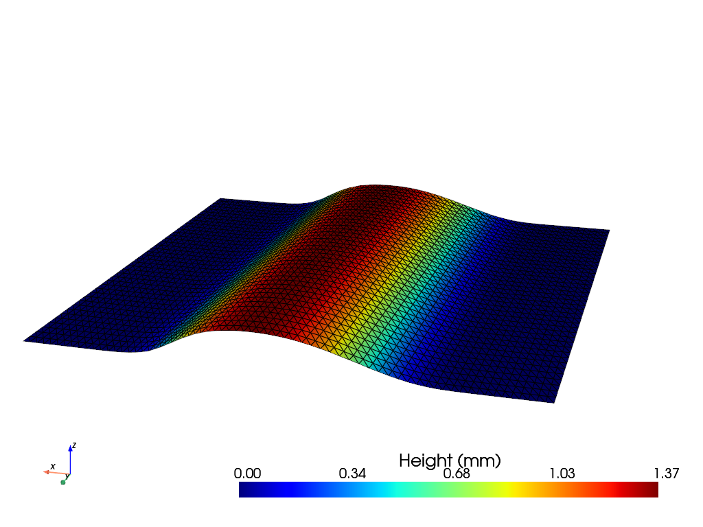

# Cold Spray Macroscopic Simulator

## Description
This project is designed to 3D model the Cold Spray process. The method used for this was through mesh modifcation, where we use the mathematical model of Cold Spray to adequately modify the points of the mesh.
In the repository it is included the main code, several examples, and `.obj` files that are loaded and used as meshes in both the examples and the main code. 

Key features:
- Mesh handling from `.obj` files
- Implementation of the mathematical model of the Cold Spray process.
- Optimization during the simulation of the mesh modification.
- Export final meshes.

## Prerequisites
Before getting started, ensure you have the following software installed:
1. **Anaconda** or **Miniconda**: You can download and install it from [Anaconda](https://www.anaconda.com/products/individual) or [Miniconda](https://docs.conda.io/en/latest/miniconda.html).
2. **Git**: To clone the repository, install Git from [here](https://git-scm.com/).

## Installation
Due to limitations of one of the packages used, PyTorch3d, this project can only be installed on a Linux environment.

### Step 1: Clone the Repository

First, clone the project repository from GitHub using the following command in your terminal:

```bash
git clone https://github.com/sergio-garcia-castro/cold-spray-modeling.git
```
Then, navigate to the project folder:
```bash
cd cold-spray-modeling
```
Use the cold_spray.yml file provided in the repository to recreate the project's virtual environment. This file contains all the required dependencies for running the project.

Create and activate the environment using the following commands:
```bash
conda env create -f cold_spray.yml
conda activate ColdSpray
```
This will install all the necessary packages.

## Usage
The code was developed in Python using the following main libraries:
* [PyTorch](https://pytorch.org): for tensor computation of mathematical operations and optimization.
* [PyTorch3D](https://pytorch3d.org): for manipulating and modifying 3D meshes from simulations.

The file `cold_spray.py` is divided into four parts, each corresponding to a different Python class. Below, we describe the main features of each class:

- `MeshHandler`: This class is responsible for loading meshes in the .obj format and converting them into a valid mesh for PyTorch3D. We use it, for example, to load the initial substrate. Once the mesh is loaded, we extract the main properties of it, including:
    - The list of vertices that make up the mesh.
    - The list of triangular faces, each face being represented by a list containing the identifiers of the vertices that define it.
    - The dimensions of the substrate, such as the width and length.

- `Nozzle`: We define the nozzle by some of its properties, such as:
    - The position of its center $N = (x_N, y_N, z_N)$.
    - The normal vector to its surface $v_N = (v_{N_x}, v_{N_y}, v_{N_z})$.
    - The movement speed $u_N$.
    - The radius of the nozzle $R_N$.
    - The projection distance $s_N$.

    The simulations performed in this work mainly concern line deposits with a certain     number of passes and nozzle orientation. The position and normal of the nozzle         evolve according to the following formulas respectively:

    - $N = (s_N\sin(\theta_N), y_N, s_N\cos(\theta_N))$
    - $\vec{v}_N = (\sin(\theta_N), 0, \cos(\theta_N))\$       

    where $\theta_N$ is the spray angle, representing the angle formed by 
the nozzle with the z-axis of the reference frame. 

    In this class, we also define the functions $\phi(r)$ and $DE(\alpha)$ that describe the inifnitesimal formation of deposition according to:

    $$dz_{\vec{v}_N}(r) = -DE(\alpha) \phi(r) dt\cdot \frac{\vec{v}_N}{\|\vec{v}_N\|}$$

- `MeshModification`: This part is the most crucial for the simulation.  Here, we implement the mathematical equations of the model to the vertices of the mesh ensuring the mass conservation and the simulation of the shadow effect via our implementation of the Möller–Trumbore ray tracing algorithm.
    The implementation of mathematical calculations were performed in a vectorized manner.

- `MeshOptimization`: This class is used to solve optimization problems in which we seek to adjust a mesh obtained from our simulation $M_s$ to a target mesh $M_t$, by minimizing a loss function $L(p)$ of the form:

    $L(p) = \|M_s(p) - M_t\|$,

    where $p \in\mathbb{R}^m$ represents the optimization parameters, and where the distance used is the chamfer distance provided by the PyTorch3d library. The optimization method used is gradient descent, with the Adam optimizer provided by PyTorch. Adjust the learning rate $lr$ according to the optimization parameters and the needs of the simulation.

You can find more deatiled information about the methods used in each class in the `cold_spray.py` file.

The file `main.py` contains a first demonstration of the simulation and optimization of the Cold Spray simulation. In this file we perform the following simulation : 

1. We load the mesh of the initial substrate, for example, a flat substrate. 
   Then, we position the nozzle at its initial position $N_0 = (s_{N_0}sin(\theta_{N_0}), -\frac{R}{2}, s_{N_0}cos(\theta_{N_0}))$. 
   The angle $\theta_{N_0}$ can remain constant or vary during the simulation.

2. The total time for one pass is given by $t_f = \frac{(2R_N + l_y)}{u_N}$, the final position of the nozzle is $N_f = (s_{N_f}sin(\theta_{N_f}), \frac{R}{2}+l_y, s_{N_f}cos(\theta_{N_f}))$, where $l_y$ is the length of the substrate.
   We discretize this time by choosing a time step $dt$, which gives a number
   $\displaystyle n_t = \Big\lfloor \frac{t_f}{dt} \Big\rfloor + 1$ of time steps. 
   At each time step m, we update the position of the nozzle using

    $N_m = (s_{N}\sin(\theta_{N_m}), -\frac{R}{2} + u_N \cdot m \cdot dt, s_{N}\cos(\theta_{N_m}))$,
   as well as the corresponding normal. 
   We then apply the ray tracing algorithm to identify valid faces and vertices for the deposition generation. 
   The valid points are then modified according to model's equations, finally the mesh is updated.

3. We repeat the process for each time step and for the number of passes.

Check out the [examples](examples/) for more applications of the simulator.

## Recommended modules
The PyTorch3D library does not provide a visualiton module for the meshes, we recommend using the [PyVista](https://docs.pyvista.org) library for visualitation processes. The following code shows how to do this.

```python
>>> import pyvista as pv

>>> reader = pv.get_reader(file_path)     # Modify the file_path with the path of the .obj mesh file. 
>>> mesh = reader.read()
>>> z = mesh.points[:,2]

>>> pl = pv.Plotter()
>>> pl1.add_scalar_bar(title = "Height (mm)", scalars = z, interactive = True, vertical=True, n_labels = 5, title_font_size=25, label_font_size=20, font_family = "arial", outline = False, fmt='%8.2f',)
>>> pl.add_axes(interactive=True)
>>> pl.show()
```


